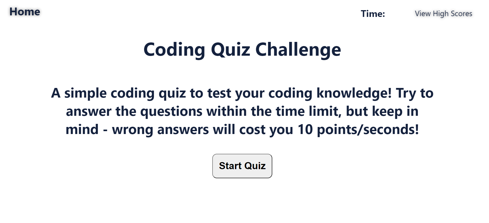

# Code Quiz

Deployed at [https://nitrotap.github.io/code-quiz/](https://nitrotap.github.io/code-quiz/)   

Code quiz is a game that tests your coding knowledge! Using time as a scoring method, try to complete the quiz before times runs out. But, be careful to choose only correct answers or your score (and time!) will decrease by 10. Do your best and add your name to the high scores list!

## Acceptance Criteria   
GIVEN I am taking a code quiz   
WHEN I click the start button    
THEN a timer starts and I am presented with a question    
WHEN I answer a question   
THEN I am presented with another question   
WHEN I answer a question incorrectly   
THEN time is subtracted from the clock   
WHEN all questions are answered or the timer reaches 0   
THEN the game is over   
WHEN the game is over   
THEN I can save my initials and score    